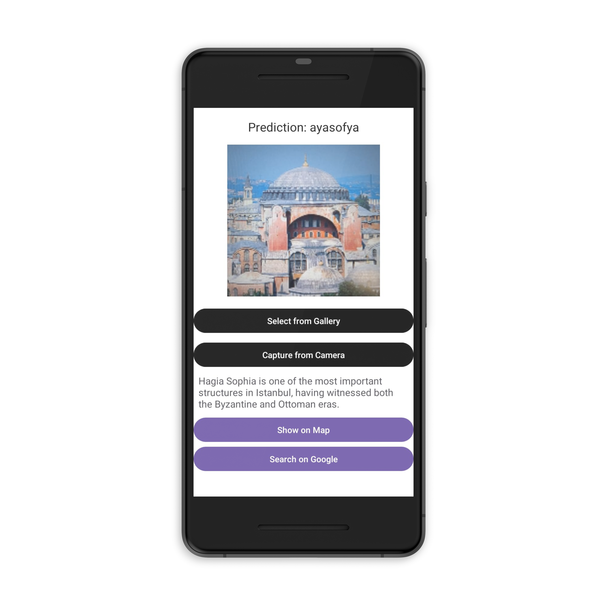

<h1 align="center">:iphone::camera::european_castle:HistofyApp - Deep Learning-Based Mobile Application for Historical Landmark Recognition</h1>

  
  
  
  
  

  This Android mobile application aims to recognize historical landmarks in Istanbul using image processing and deep learning techniques.
  Users can upload images from the gallery or capture them via camera to identify structures such as Hagia Sophia, Galata Tower, and Maiden's Tower.
  The app provides descriptive information, map location access, and web search functionality for each recognized landmark. 
  It utilizes TensorFlow Lite-optimized MobileNetV2 and EfficientNetB0 models for on-device inference.

## :camera_flash: Screenshots

<table style="width: 100%; table-layout: fixed;">
  <tr>
    <th style="text-align: center; border: none;">Splash Activity</th>
    <th style="text-align: center; border: none;">Home Page</th>
    <th style="text-align: center; border: none;">Gallery Prediction 1</th>
  </tr>
  <tr>
    <td style="height: 300px; width: 33.33%; text-align: center; border: none;">
      
    </td>
    <td style="height: 300px; width: 33.33%; text-align: center; border: none;">
      
    </td>
    <td style="height: 300px; width: 33.33%; text-align: center; border: none;">
      
    </td>
  </tr>
  <tr>
    <th style="text-align: center; border: none;">Show on Map</th>
    <th style="text-align: center; border: none;">Search on Google</th>
    <th style="text-align: center; border: none;">Gallery Prediction 2</th>
  </tr>
  <tr>
    <td style="height: 300px; width: 33.33%; text-align: center; border: none;">
      
    </td>
    <td style="height: 300px; width: 33.33%; text-align: center; border: none;">
      
    </td>
    <td style="height: 300px; width: 33.33%; text-align: center; border: none;">
      
    </td>
  </tr>
  <tr>
    <th style="text-align: center; border: none;">Gallery Prediction 3</th>
    <th style="text-align: center; border: none;">Capture from Camera</th>
    <th style="text-align: center; border: none;">Camera Prediction</th>
  </tr>
  <tr>
    <td style="height: 300px; width: 33.33%; text-align: center; border: none;">
      
    </td>
    <td style="height: 300px; width: 33.33%; text-align: center; border: none;">
      
    </td>
    <td style="height: 300px; width: 33.33%; text-align: center; border: none;">
      
    </td>
  </tr>
</table>

## :question: How To Run ?

You can upload an image by clicking on the 'Select from Gallery' or 'Capture from Camera' options on the homepage. Once the image is uploaded,
a deep learning model will make a prediction, and a brief introduction about the historical site will be displayed along with the result. 
Additionally, you can view the location of the historical site on Google Maps and automatically perform a search on Google.
